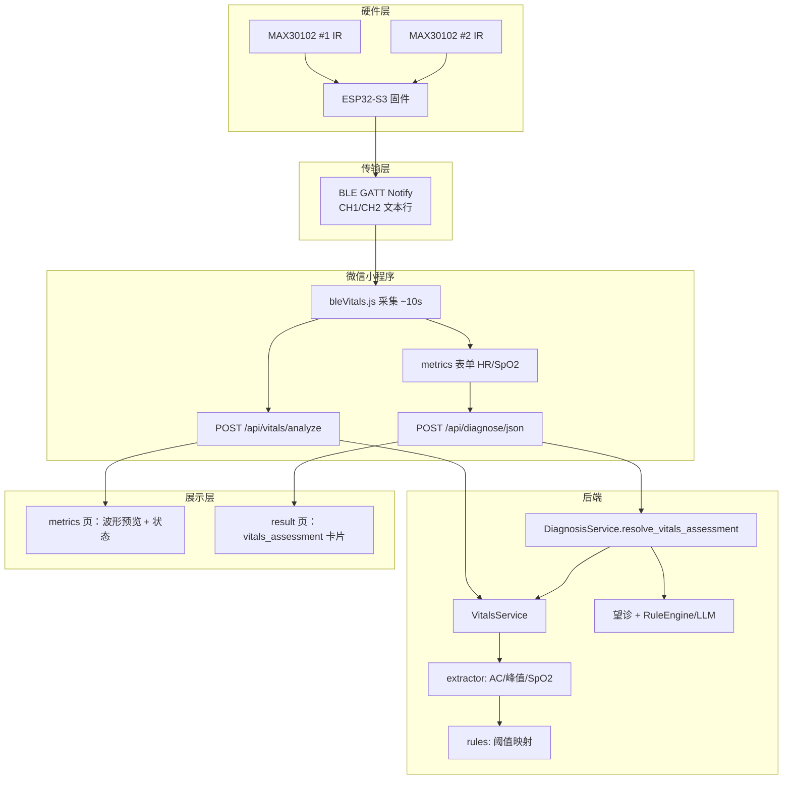
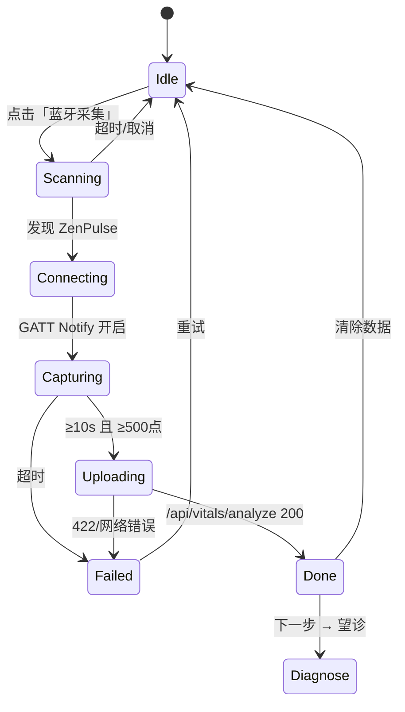

# 生理参数采集与规则映射开发文档

> **项目**：ZenPulse 中医 AI 诊断系统  
> **版本**：v1.0（MAX30102 · BLE 主路径）  
> **状态**：已实施（主链路）  
> **前身**：v0.x「脉象算法」文档 —— **脉象分类已弃用**，改由生理参数规则映射参与辨证  
> **关联文档**：[硬件开发指南.md](./硬件开发指南.md)、[脉象硬件腕带方案.md](./脉象硬件腕带方案.md)、[开发文档.md](./开发文档.md)

---

## 1. 文档目的

本文档定义 **MAX30102 → BLE → 后端 → 规则映射 → 前端** 的完整逻辑，供固件、后端、小程序协同开发与答辩说明。

### 1.1 范围

| 包含 | 不包含 |
|------|--------|
| 双通道 MAX30102 IR 采集 | 迟/数/滑/涩/弦等 **中医脉名** 推断 |
| ESP32 BLE GATT 推流 | 浮沉、寸关尺、指压分级 |
| 后端 HR / SpO2 提取 | 医疗级血氧/血压认证 |
| `vitals_rules.yaml` 阈值规则 | LLM 提示词与 RAG 细节 |
| 与 `/api/diagnose` 融合输出 `vitals_assessment` | OpenRing 戒指深度学习模型 |

### 1.2 产品表述原则

对用户统一表述为：

> 「通过腕带光学传感器采集脉搏波，**估算**心率与血氧，并结合望诊与体征规则给出健康参考，**不能替代**医师切诊与临床设备测量。」

**禁止**对外使用「脉象类型」「迟脉/数脉」等切诊结论作为主输出（旧 `pulse_characteristics` 已空置）。

---

## 2. 架构总览

### 2.1 端到端数据流



### 2.2 与旧「脉象链路」的关系

| 旧路径（已降级） | 新路径（主路径） |
|------------------|------------------|
| `POST /api/pulse/analyze` → 迟/数/不齐 | `POST /api/vitals/analyze` → HR/SpO2 状态 |
| `PulseEngine` + `classifier_rules` | `VitalsService` + `vitals/rules` |
| `pulse_characteristics` 写入诊断 | `vitals_assessment` 写入诊断 |
| WiFi TCP 为主、小程序演示波形 | **BLE 为主**，TCP 保留调试 |
| 15s 波形 + 有效心搏质控 | **≥5s / ≥500 点** 即可分析 |

`domain/pulse/` 与 `/api/pulse/*` **代码保留**，供实验与回归测试，**不接入**小程序主流程。

---

## 3. 域模型

### 3.1 核心对象：`VitalsAssessment`

```python
@dataclass
class VitalsAssessment:
    success: bool
    heart_rate: float      # bpm
    pulse: int             # 与 heart_rate 取整一致，供表单/融合
    spo2: float            # %，算法近似
    hr_status: str         # 正常 | 偏慢 | 偏快 | 未知
    spo2_status: str        # 正常 | 偏低 | 过低 | 未知
    overall_status: str    # 正常 | 需关注 | 待确认 | 失败
    alerts: List[str]      # 规则触发的提示
    suggestions: List[str] # 用户可读建议
    quality_score: float   # 0–1，与采样长度相关
    source: str            # max30102_ble | manual | fallback
    sample_count: int
    duration_sec: float
    limitations: List[str] # 能力边界声明
    error: Optional[str]
```

### 3.2 输入来源优先级（`DiagnosisService.resolve_vitals_assessment`）

```
1. stm_data.vitals_assessment     # 已分析，直接透传
2. max30102_samples / pulse_waveform + source.startswith("max30102")
   → VitalsService.analyze_samples()
3. heart_rate + pulse（手动或蓝牙回填后的表单）
   → VitalsService.analyze_manual()
4. DEFAULT_VITALS_ASSESSMENT      # 占位失败态
```

### 3.3 融合侧使用方式

`DiagnosisService.run()` 在辨证前：

1. 调用 `resolve_vitals_assessment()`  
2. 将 `heart_rate` / `pulse` / `spo2` **写回** `stm_data` 供 `FusionEngine` / `RuleEngine`  
3. 诊断 Markdown 追加 **「生理参数（MAX30102）」** 小节（非脉象小节）  
4. API 响应字段：`vitals_assessment`；`pulse_characteristics` 固定 `{}`（兼容旧客户端）

---

## 4. 信号处理逻辑

**模块**：`tcm_ai/domain/vitals/extractor.py`

### 4.1 预处理

| 步骤 | 说明 |
|------|------|
| 双通道合并 | `merge_dual_channel(ch1, ch2)` 逐点平均；长度不一致时取较短通道并写入质控告警 |
| AC/DC 分离 | `dc = mean(raw)`，`ac = raw - dc` |
| 带通滤波 | Butterworth 0.5–5 Hz（与采样率适配） |

### 4.2 心率估计

1. 对 AC 分量带通滤波  
2. 阈值峰值检测：`mean + 0.6 * std`  
3. 峰间隔均值 → BPM，钳制 **40–180**  

### 4.3 血氧估计（近似）

基于单通道 IR 的 AC/DC 比启发式：

```
ac_ratio = std(ac) / |dc|
spo2 = clamp(100 - ac_ratio * 8, 70, 100)
```

> **声明**：非双波长比值法，**不可**与医疗血氧仪对比认证；必须在 `limitations` 中说明。

### 4.4 质控门槛（`config/vitals_rules.yaml`）

| 参数 | 默认值 | 失败码 |
|------|--------|--------|
| `min_samples_sec` | 5 | `sample_too_short` 类提示 |
| `min_sample_count` | 500 | 同上 |
| 提取 HR ≤ 0 | — | `未能从波形中提取有效心率` |

`quality_score = min(1, len(samples) / (fs * 10))`

---

## 5. 规则映射逻辑

**模块**：`tcm_ai/domain/vitals/rules.py`  
**配置**：`config/vitals_rules.yaml`

### 5.1 心率规则

| 条件 | `hr_status` | 典型 alert |
|------|-------------|------------|
| HR < 60 | 偏慢 | 心率偏慢（N bpm） |
| 60 ≤ HR ≤ 100 | 正常 | — |
| HR > 100 | 偏快 | 心率偏快（N bpm） |

### 5.2 血氧规则

| 条件 | `spo2_status` | 典型 alert |
|------|---------------|------------|
| SpO2 ≥ 95% | 正常 | — |
| 90% ≤ SpO2 < 95% | 偏低 | 血氧偏低 |
| SpO2 < 90% | 过低 | 血氧过低，建议就医 |

### 5.3 综合状态

| 条件 | `overall_status` |
|------|------------------|
| HR 正常 且 SpO2 正常 | 正常 |
| 任一 alert | 需关注 |
| 数据缺失 | 待确认 / 失败 |

### 5.4 与中医辨证规则的关系

`RuleEngine` 仍使用 `stm_data.heart_rate` / 血压做 **证候倾向** 辅助（如 HR>100 → 心火旺），但这是 **规则引擎层**，不是脉象模块输出。

---

## 6. API 契约

### 6.1 `POST /api/vitals/analyze`

**用途**：小程序 BLE 采集后上传原始 IR 序列，获取规则评估结果。

**请求**

```json
{
  "samples": [100512, 100498, "..."],
  "samples_ch2": [100520, "..."],
  "fs": 100,
  "source": "max30102_ble"
}
```

**成功响应（200）**

```json
{
  "success": true,
  "heart_rate": 72.0,
  "pulse": 72,
  "spo2": 97.2,
  "hr_status": "正常",
  "spo2_status": "正常",
  "overall_status": "正常",
  "alerts": [],
  "suggestions": [],
  "quality_score": 0.85,
  "source": "max30102_ble",
  "sample_count": 1000,
  "duration_sec": 10.0,
  "limitations": [
    "数据来自 MAX30102 光学传感器估算，非医疗级设备",
    "血氧为算法近似值，不能用于临床诊断"
  ],
  "disclaimer": "本结果仅供参考..."
}
```

**失败（422）**：采样不足或无法提取心率。

**限流**：`ensure_public_vitals_allowed`，scope=`vitals`。

### 6.2 `POST /api/diagnose/json`（体征相关字段）

| 字段 | 说明 |
|------|------|
| `heart_rate`, `pulse` | 必填；可由 `/api/vitals/analyze` 回填 |
| `systolic`, `diastolic` | 必填；**手填**（MAX30102 不测血压） |
| `spo2` | 可选；蓝牙分析后传入 |
| `vitals_assessment` | 可选；**优先**透传（§3.2 优先级 1），须 `success: true` 且含有效 `heart_rate` |
| `pulse_waveform` | 可选；CH1 IR 序列，`pulse_source=max30102_ble` 且无透传时后端再分析 |
| `max30102_samples_ch2` | 可选；CH2 序列，与 CH1 双通道合并重分析 |
| `pulse_fs` | 默认 100 |
| `pulse_source` | 默认 `manual`；蓝牙路径为 `max30102_ble` |

**响应新增/主用**

```json
{
  "vitals_assessment": { "...": "见 §3.1" },
  "pulse_characteristics": {}
}
```

### 6.3 弃用接口（保留不删）

| 接口 | 状态 |
|------|------|
| `POST /api/pulse/analyze` | 实验用，输出脉象/研究轨 |
| `POST /api/pulse/sessions` | 脉象会话日志，非主路径 |

---

## 7. 固件逻辑

**路径**：`firmware/esp32_pulse_wrist/`

### 7.1 采样

- 双 MAX30102，I2C 地址 `0x57` / `0xAE`
- 采样率 `SAMPLE_HZ = 100`
- 每 tick 读取 `getIR()`，**不依赖 TCP 连接**（BLE 可独立推流）

### 7.2 BLE GATT（`ENABLE_BLE=1`）

| 项 | 值 |
|----|-----|
| 广播名 | `ZenPulse` |
| Service UUID | `0000fff0-0000-1000-8000-00805f9b34fb` |
| Notify UUID | `0000fff1-0000-1000-8000-00805f9b34fb` |
| 载荷格式 | `CH1:{ir1},CH2:{ir2}\n`（与 TCP v0 一致） |

### 7.3 WiFi TCP（调试保留）

- 端口 `8080`，协议与历史 `STMDataProcessor` 兼容  
- 实验室可用 `scripts/hardware/pulse_collector.py` 直连接分析

### 7.4 OLED 显示屏（`ENABLE_OLED=1`）

| 项 | 值 |
|----|-----|
| 屏 | 0.96" SSD1306 128×64，I2C @ **0x3C** |
| 总线 | 与 MAX30102 **共用** GPIO8/9 |
| 模块 | `display_ui.cpp` |
| 刷新 | 4 Hz（250 ms，不阻塞采样） |
| 显示 | BLE 连接、信号 OK、本地 HR 估算、IR 读数 |

```c
#define ENABLE_OLED 1
#define OLED_I2C_ADDR 0x3C
```

屏装在外侧主控仓顶面；**精确 SpO2/诊断仍走手机 + 后端**。

### 7.5 配置项（`config.h`）

```c
#define ENABLE_BLE 1
#define ENABLE_OLED 1
#define ENABLE_IMU 0
#define SAMPLE_HZ 100
```

---

## 8. 小程序逻辑

### 8.1 采集流程（`utils/bleVitals.js`）

```
openBluetoothAdapter
  → startBluetoothDevicesDiscovery（过滤名称含 ZenPulse）
  → createBLEConnection
  → notifyBLECharacteristicValueChange (FFF1)
  → 解析 CH1/CH2 行，缓冲 ~10s（≥500 点）
  → closeBLEConnection
```

### 8.2 分析流程（`pages/metrics/metrics.js`）

```
captureBleVitals(10s)
  → analyzeVitals(ch1, { samples_ch2: ch2, source: 'max30102_ble' })
  → 回填 metrics.heart_rate / pulse / spo2
  → 保存 pulse_waveform 供 diagnose 二次确认（可选）
  → vitalsCapture 展示 hr_status / spo2_status / overall_status
```

### 8.3 诊断流程（`pages/upload/upload.js`）

```
wxDiagnose(formData)
  → pulse_waveform + pulse_source=max30102_ble + spo2
  → DiagnosisService 内 resolve_vitals_assessment 再算或用手填值
```

### 8.4 结果展示（`pages/result/result.wxml`）

展示 `diagnosisResult.vitals_assessment` 卡片：**心率、血氧、综合评估、alerts、suggestions**。  
**不再展示** `pulse_characteristics` 脉象块。

### 8.5 权限（`app.json`）

- **`permission.scope.bluetooth`**：蓝牙授权说明文案  
- **`utils/privacy.js`**：`getPrivacySetting` / `agreePrivacyAuthorization`（基础库 ≥ 2.32.3）  
- 微信公众平台后台「用户隐私保护指引」需勾选 **蓝牙**（正式版）  
- **注意**：`requiredPrivateInfos` 仅支持位置类 API，**不可**填入蓝牙接口；误配会导致编译报错

---

## 9. 代码索引

| 层级 | 路径 | 职责 |
|------|------|------|
| 配置 | `config/vitals_rules.yaml` | HR/SpO2 阈值 |
| 配置 | `tcm_ai/domain/vitals/constants.py` | 波形采样上限等常量 |
| 域 | `tcm_ai/domain/vitals/extractor.py` | 波形 → HR/SpO2 |
| 域 | `tcm_ai/domain/vitals/rules.py` | 阈值 → 状态/建议 |
| 域 | `tcm_ai/domain/vitals/models.py` | `VitalsAssessment` |
| 服务 | `tcm_ai/services/vitals_service.py` | 编排入口 |
| API | `tcm_ai/api/routes/vitals.py` | `/api/vitals/analyze` |
| 诊断 | `tcm_ai/services/diagnosis_service.py` | `resolve_vitals_assessment` |
| 固件 | `firmware/esp32_pulse_wrist/ble_transport.cpp` | BLE 推流 |
| 小程序 | `wechat-miniprogram/utils/bleVitals.js` | 采集 |
| 小程序 | `wechat-miniprogram/utils/api.js` | `analyzeVitals()` |
| 测试 | `tests/unit/test_vitals_service.py` | 单元测试 |
| 测试 | `tests/integration/test_vitals_api.py` | API 集成 |

---

## 10. 状态机（用户侧）



---

## 11. 测试与验收

### 11.1 自动化

```bash
pytest tests/unit/test_vitals_service.py tests/integration/test_vitals_api.py -q
```

### 11.2 人工验收清单

- [ ] 固件烧录后手机能搜到 `ZenPulse`  
- [ ] 小程序采集 10s 后 HR/SpO2 有合理数值  
- [ ] `/api/vitals/analyze` 返回 `overall_status`  
- [ ] 诊断结果页展示生理参数卡片，**无**脉象类型  
- [ ] `limitations` 文案出现在采集完成区  
- [ ] 手动填 HR 仍可走 `analyze_manual` 降级  

### 11.3 已知局限

1. SpO2 为单通道启发式，误差大，仅作趋势参考  
2. 未实现运动伪影剔除（静止采集靠 UI 引导）  
3. 血压不参与 MAX30102 链路  
4. 真机 BLE 需微信基础库与系统蓝牙权限  

### 11.4 毕设答辩演示（软件 + 局域网）

1. 笔记本：`python3 web_server.py`（可选另开 Ollama）
2. 确认 `wechat-miniprogram/config/env.js` 中 `customBaseUrl` 为本机局域网 IP（如 `http://192.168.x.x:8000/api`）
3. 微信开发者工具 → 预览 → 真机扫码；勾选「不校验合法域名」
4. 演示路径：**体征（蓝牙或手填）→ 望诊上传 → 结果页 `vitals_assessment`**
5. 备用：提前录 2–3 分钟完整操作视频；蓝牙失败时改用手填 HR 继续后半段

---

## 12. 后续扩展（非当前范围）

| 方向 | 说明 |
|------|------|
| 运动质控 | 复用 `ENABLE_IMU` + 滑动窗拒识 |
| 双波长 SpO2 | 启用 MAX30102 Red + 标定系数 |
| 后台实时流 | WebSocket 替代「采完再传」 |
| Web 端 | `frontend/index.html` 接 Web Bluetooth 或 TCP 代理 |
| 数据标注 | 导出 `vitals_assessment` + 波形供算法迭代 |

---

## 13. 修订记录

| 版本 | 日期 | 说明 |
|------|------|------|
| v0.1–v0.3 | 2026-Q1 | 脉象（迟/数/律）+ PPG 研究轨方案 |
| **v1.0** | 2026-Q2 | **弃用脉象主路径**；MAX30102 BLE → `vitals_assessment` 规则映射；文档整体重写 |

---

## 附录 A：旧版脉象模块归档说明

以下模块仍存在于仓库，**默认不启用于产品主路径**：

- `tcm_ai/domain/pulse/*`、`tcm_ai/services/pulse_engine.py`
- `POST /api/pulse/analyze`、`config/pulse_rules.yaml`
- 小程序 `analyzePulse()`（已标记 deprecated）

若研究需要脉象特征，可单独调用 `/api/pulse/analyze`，结果 **不得** 写入用户诊断报告的脉名栏位。

## 附录 B：BLE 行协议示例

```
CH1:100512,CH2:100498
CH1:100505,CH2:100501
...
```

解析正则：键值对 `CH1`/`CH2`，整数 IR 计数，换行分隔。
