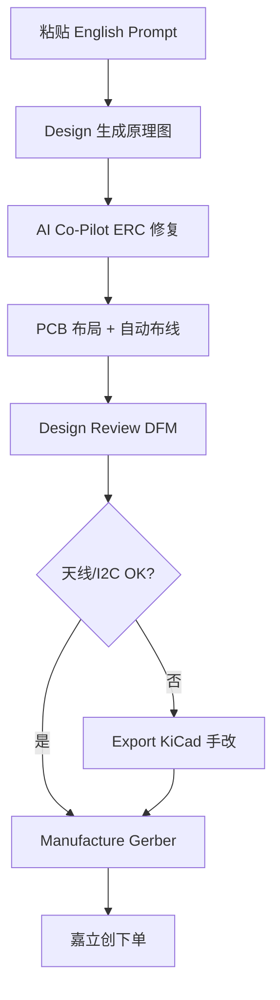

<!-- Copyright (c) 2026 paidaxin-12138 — CC BY-NC 4.0 — see LICENSE -->

# 使用 AI-PCB-Generator 设计 ZenPulse 手环 PCB

> 工具：[AI-PCB-Generator](https://github.com/22507260/AI-PCB-Generator)（开源，自然语言 → 原理图 → 布局 → Gerber）  
> 本项目规格：`PCB设计指南.md` + 下方两份 Prompt

---

## 1. 为什么拆两块板、两次生成

AI-PCB-Generator 适合 **单块功能板** 的自然语言描述。ZenPulse 是 **Main + Sensor + FPC**，请：

| 次序 | 工程 | Prompt 文件 |
|------|------|-------------|
| 1 | Main 主控板 | `AI-PCB-Generator-prompt-main.md` |
| 2 | Sensor 传感板 | `AI-PCB-Generator-prompt-sensor.md` |

不要在一次 Prompt 里写「两块板 + FPC」——AI 容易漏天线规则或 I2C 地址。

---

## 2. 环境安装（macOS）

```bash
git clone https://github.com/22507260/AI-PCB-Generator.git
cd AI-PCB-Generator
python3 -m venv venv
source venv/bin/activate
pip install -r requirements.txt
python setup_vendor.py

cp .env.example .env
# 编辑 .env，填入其一：
# OPENAI_API_KEY=sk-...
# 或 Gemini / Claude 等（见工具 Settings）

python main.py
```

可选：安装 **KiCad 9**（导出后人工改天线区）、**Java 11+**（Freerouting 自动布线）。

---

## 3. 推荐工作流（每块板重复）



### Step 1 — 输入

- 打开 `AI-PCB-Generator-prompt-main.md`，复制 **English Prompt** 全文到左栏  
- 可追加一句：`Use LCSC/JLCPCB in-stock parts only.`

### Step 2 — 生成与 ERC

- 点 **Design**  
- 打开 **AI Co-Pilot**，修复：未接 GND、LED 缺电阻、LDO 缺去耦等

### Step 3 — 布局审查（人工，不可跳过）

Main 板必查：

| 项 | 要求 |
|----|------|
| ESP32-S3 天线 | 板边，外侧 15 mm 净空 |
| GPIO8/9 | 接 I2C SDA/SCL |
| FPC Pin2 | 3V3 粗线 |
| 电池 | 远离天线 |

Sensor 板必查：

| 项 | 要求 |
|----|------|
| MAX30102 #1 ADDR | GND → 地址 0x57 |
| MAX30102 #2 ADDR | 3V3 → 地址 0xAE |
| LED 方向 | Bottom 层朝皮肤 |
| 间距 | 12 mm |

### Step 4 — DFM & 制造

- **Design Review** 标签：目标分数 > 80，无 Critical  
- **Manufacture** → 选 **JLCPCB** → 4 层(Main) / 2 层(Sensor) → 导出 Gerber ZIP + BOM + CPL  

### Step 5 — KiCad 精修（强烈建议）

AI 对 **ESP32-S3 天线 keep-out** 经常做错：

1. Export → **KiCad .kicad_pcb**  
2. 用 KiCad 9 打开，对照 [ESP32-S3 Hardware Design Guidelines](https://www.espressif.com/sites/default/files/documentation/esp32-s3_hardware_design_guidelines_en.pdf) 删天线区铜皮  
3. 再 DRC → 重新导出 Gerber  

---

## 4. 与固件对齐检查表

烧录 `firmware/esp32_pulse_wrist/` 前：

```bash
# 先烧 i2c_scanner，应看到：
# 0x3C  OLED
# 0x57  MAX30102 #1
# 0xAE  MAX30102 #2
# (可选 0x68 MPU6050)
```

`config.h` 无需改引脚（已固定 GPIO8/9）：

```c
#define I2C_SDA 8
#define I2C_SCL 9
#define ENABLE_BLE 1
#define ENABLE_OLED 1
```

---

## 5. AI 工具的局限（务必知晓）

| 能力 | AI-PCB-Generator | 你需要补 |
|------|------------------|----------|
| 原理图/布局 | ✅ 快 | 核对型号 |
| BLE 天线净空 | ⚠️ 常错 | KiCad 手改 |
| 双 MAX30102 地址 | ⚠️ 可能相同 | Sensor 板手改 ADDR |
| 14×14 模块 vs 裸芯片 | ⚠️ 随机 | 首版强制模块 footprint |
| 弧形腕带机械 | ❌ 不懂 | 结构件 R40 另做 |
| FPC 长度/弯折 | ❌ 不懂 | 实物试 60–80 mm |

**结论**：用 AI 生成 **80% 初版**，天线 + 传感器地址 + 电源线宽 **必须人工复核**。

---

## 6. 下单参数（嘉立创）

| 板 | 层数 | 尺寸 | 厚度 | 表面处理 |
|----|------|------|------|----------|
| Main | 4 | 38×28 mm | 1.0 mm | 沉金 |
| Sensor | 2 | 34×16 mm | 0.8 mm | 沉金 |

首版各 **5 片**；SMT 建议 Main 板钢网 + 手焊 Sensor 板模块。

---

## 7. 文件索引

| 文件 | 用途 |
|------|------|
| `AI-PCB-Generator-prompt-main.md` | Main 板英文 Prompt |
| `AI-PCB-Generator-prompt-sensor.md` | Sensor 板英文 Prompt |
| `PCB设计指南.md` | 详细电路/布局说明 |
| `../wrist_bracket/SPEC.md` | 机械与 OLED 开窗 |

---

## 8. 若生成失败或结果很差

1. **缩短 Prompt**：先只做 Main 板电源 + ESP32 + FPC，成功后再加 OLED/USB  
2. **换模型**：Settings 里 GPT-4o / Claude 对复杂 IC 更稳  
3. **模板起步**：选工具内 **Sensor Module** 模板，再手动加 ESP32 与 FPC  
4. **导出 KiCad 手画**：AI 只生成原理图，布局在 KiCad 自己摆（天线仍可控）

---

## 9. 下一步

- [ ] 用 Main Prompt 生成并导出 KiCad  
- [ ] 用 Sensor Prompt 生成第二块  
- [ ] 订 8P FPC 软排线（0.5 mm 同向/异向与座子匹配）  
- [ ] 3D 打印外壳（OLED 窗 + 传感器 O 圈槽）  
- [ ] `i2c_scanner` → `esp32_pulse_wrist` 联调
