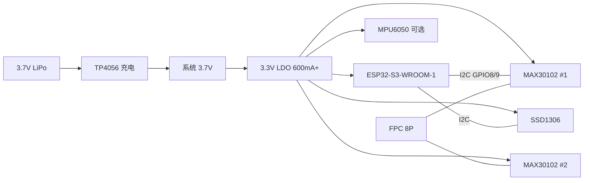

<!-- Copyright (c) 2026 paidaxin-12138 — CC BY-NC 4.0 — see LICENSE -->

# ZenPulse 手环 PCB 设计指南

> 目标：双 MAX30102 内侧传感 + ESP32-S3 外侧主控 + OLED + 锂电 + BLE  
> 固件引脚：`firmware/esp32_pulse_wrist/config.example.h`（I2C GPIO8/9）  
> 机械参考：`hardware/wrist_bracket/SPEC.md`  
> **AI 生成 PCB**：见 [`AI-PCB-Generator工作流.md`](./AI-PCB-Generator工作流.md) + 两份 Prompt 文件

---

## 1. 设计策略：两块板 + FPC

不要做单板「传感器贴皮肤又叠 MCU」——佩戴体验差、BLE 天线被遮挡。

```
┌──────────────── Main PCB（腕背外侧）────────────────┐
│  ESP32-S3-WROOM-1                                    │
│  OLED SSD1306（贴板或 ZIF 座）                        │
│  TP4056 + DW01 + 3.3V LDO                            │
│  LiPo 连接器 / 弹片充电                                │
│  KEY ×1（开始采集）  LED ×1（充电指示）                 │
│  FPC 8P 座 ──────────────────────────────────────────┼──► 至 Sensor PCB
└──────────────────────────────────────────────────────┘

┌──────────────── Sensor PCB（桡侧贴皮肤，32×14 mm）───┐
│  MAX30102 #1 (ADDR=0x57)   MAX30102 #2 (ADDR=0xAE)   │
│  LED 窗口朝下 · 每颗 100nF 去耦 · 可选 MPU6050       │
│  FPC 8P 座                                            │
└──────────────────────────────────────────────────────┘
```

| 板名 | 尺寸（建议） | 层数 | 厚度 |
|------|-------------|------|------|
| **Main** | 38 × 28 mm | **4 层**（RF 友好） | 1.0 mm |
| **Sensor** | 34 × 16 mm | 2 层 | 0.8 mm |

---

## 2. 系统框图



---

## 3. 引脚分配（与现固件一致）

### 3.1 ESP32-S3-WROOM-1（Main PCB）

| ESP32-S3 引脚 | 功能 | 连接 | 备注 |
|---------------|------|------|------|
| **GPIO8** | I2C SDA | FPC-3、OLED SDA | 固件 `I2C_SDA` |
| **GPIO9** | I2C SCL | FPC-4、OLED SCL | 固件 `I2C_SCL` |
| GPIO0 | BOOT | 测试点 / 暂不接按键 | 量产烧录 |
| GPIO46 或空闲 | KEY | 轻触开关 → GND | 下拉 10k，按下开始 10s 采集 |
| GPIO3 | LED | 充电/状态 LED | 经 1k 限流 |
| 3V3 | 电源 | LDO 输出 | 去耦 10µF + 100nF ×2 贴近模组 |
| GND | 地 | 完整地平面 | — |
| **禁止** | — | GPIO19/20 | USB 专用 |
| **禁止** | — | GPIO26–32 | Flash/PSRAM 占用（N16R8） |

> 若用 **ESP32-S3-MINI-1** 模组，引脚表以数据手册为准，仍优先保留 GPIO8/9 作 I2C。

### 3.2 FPC 8P 定义（Main ↔ Sensor）

| Pin | 信号 | 说明 |
|-----|------|------|
| 1 | GND | 多地过孔 |
| 2 | **3V3** | 传感器供电，Main 端 LDO 供给 |
| 3 | **SDA** | I2C，串联 **0 Ω** 或直连 |
| 4 | **SCL** | I2C |
| 5 | GND | — |
| 6 | NC | 预留 INT（MAX30102 中断，可选） |
| 7 | NC | 预留 IMU INT |
| 8 | GND | 屏蔽 |

- 连接器：**0.5 mm 间距 FPC 座 8P**（如 OK-008M04）  
- FPC 线长 **60–80 mm**，柔性线沿腕带长边走，**勿与天线区重叠**

### 3.3 Sensor PCB 网络

| 器件 | I2C 地址 | 硬件设置 |
|------|----------|----------|
| MAX30102 #1 | 0x57 | **SDO/ADDR → GND** |
| MAX30102 #2 | 0xAE | **SDO/ADDR → 3V3** |
| MPU6050（可选） | 0x68 | AD0 → GND |

两颗 MAX30102 **中心间距 12 mm**（与 `SPEC.md` 一致），LED 窗口朝 **Bottom Layer**。

---

## 4. 电源设计

### 4.1 功耗粗算

| 模块 | 典型电流 |
|------|----------|
| ESP32-S3 BLE 广播 + 100Hz 采样 | 80–120 mA 峰值 |
| 双 MAX30102 LED | 20–50 mA（视 LED 电流寄存器） |
| OLED 点亮 | 15–25 mA |
| **合计峰值** | **~150 mA** |

LDO 选 **≥600 mA** 低压差，如 **XC6220B332MR** 或 **AP2112K-3.3TRG1**。

### 4.2 充电与保护

```
USB-C 5V ──► TP4056（1A 充电，PROG 电阻设 1k）──► BAT+
                │
BAT+ ── DW01A + 8205A（保护）──► JST 1.25 软包电池
                │
                └──► Main 3.3V LDO ──► 数字部分
```

- 电池：**3.7 V 400–600 mAh** 弧形/条形软包，厚 ≤ 5 mm  
- USB-C：**6P 仅 5V/GND**（无 PD），或 **磁吸 pogo 2pin** 充电  
- 充电 LED：TP4056 **CHRG** / **STDBY** 接 GPIO 或直连 LED  

### 4.3 去耦（必做）

| 位置 | 电容 |
|------|------|
| ESP32-S3 3V3 引脚 | 10 µF + 100 nF，距引脚 < 3 mm |
| 每颗 MAX30102 VDD | **100 nF + 1 µF**，距芯片 < 2 mm |
| OLED VCC | 100 nF |
| LDO 入/出 | 10 µF |

MAX30102 的 LED 脉冲电流会在地平面产生噪声：**Sensor 板独立地岛通过 FPC 单点回 Main 地**，Sensor 区下方铺地，LED 回流路径短。

---

## 5. Main PCB 布局要点

### 5.1 ESP32-S3 天线 Keep-Out（最重要）

以 **ESP32-S3-WROOM-1** 为例（见 Espressif 《Hardware Design Guidelines》）：

- 模组 **天线区域（PCB 边缘）** 向外 **15 mm 内无铜、无电池、无 FPC**
- 天线朝向 **腕背外侧**（远离皮肤一侧）
- 模组下方 **完整地平面挖空**（天线投影区），仅保留必要走线
- **4 层板**：Layer2 完整地，天线下方 Layer2/3 **禁铺铜**

```
        ┌─── 腕带外侧（天线朝此） ───►
        │  [==== ESP32-S3 模组 ====]│← 天线在板边
        │  [  LDO  ] [ TP4056 ]     │
        │  [ OLED 窗口区 ]          │
        │  [ FPC座 ]    [ USB-C ]   │
        └───────────────────────────┘
```

### 5.2 分区

| 区域 | 内容 |
|------|------|
| A 射频区 | ESP32-S3，净空 |
| B 数字区 | LDO、充电、按键 |
| C 人机区 | OLED 正上方留 **27×15 mm** 开窗（由结构件压屏） |
| D 接口区 | FPC 座、电池焊片 |

### 5.3 I2C 走线

- SDA/SCL：**等长 ±5 mm**，线宽 0.2 mm，**包地**或 GND 平行走线  
- 串联 **33 Ω**（可选）抑制反射；总线 **2.2 kΩ 上拉** 到 3V3（Main 端一处即可，Sensor 端不再上拉）  
- 速率：**400 kHz**（固件 `Wire.setClock(400000)`）

---

## 6. Sensor PCB 布局要点

### 6.1 外形与开窗

- 板厚 **0.8 mm**，底面（贴皮肤侧）两颗 MAX30102 **LED 对准结构窗**  
- 机械层：LED 中心 **Ø5.5 mm 开窗**，周围 **2 mm 遮光墙** 在 **塑料结构件** 上实现，不在 PCB 上挖大孔  

### 6.2 器件摆放

```
Bottom（贴皮肤）视图：
    ┌─────────────────────────────┐
    │   (LED)      (LED)          │
    │   U1         U2             │  ← MAX30102，间距 12mm
    │                             │
    │        [ FPC 8P ]           │  ← 焊在 Top，线从腕带引出
    └─────────────────────────────┘
```

- **#1 近远心侧、#2 近近心侧** 与 `SPEC.md` 一致  
- 不建议在 Sensor 板放 LDO（增加厚度）；**3V3 由 Main 经 FPC 供电**

### 6.3 可选：直接用模块还是裸芯片

| 方案 | 优点 | 缺点 |
|------|------|------|
| **焊接 MAX30102 模块（14×14）** | 首版快、光学已调 | 厚 ~3 mm |
| 裸片 MAX30102 + 自研光学 | 最薄 | 光学难，需复刻 LED/PD 窗口 |

**首版建议**：Sensor 板留 **14×14 mm 模块 footprints ×2**，验证通过后再改裸片。

---

## 7. OLED 安装方式

| 方式 | 说明 |
|------|------|
| **A. 排针插接模块（首版）** | Main 板排 4×1.27 排母，OLED 模块垂直或折排 |
| **B. 贴装 + 结构压框（量产）** | SSD1306 裸屏 + FPC 转接，或 COG 屏 ZIF |

原理图：VCC/GND/SDA/SCL 与 ESP32 共总线；**ADDR 引脚接法决定 0x3C/0x3D**（一般 0x3C）。

---

## 8. 原理图模块清单（BOM 核心）

| 位号 | 型号 | 封装 | 数量 |
|------|------|------|------|
| U1 | ESP32-S3-WROOM-1-N16R8 | 模组 | 1 |
| U2,U3 | MAX30102（或模块 footprint） | QFN14 / 14×14 模块 | 2 |
| U4 | SSD1306 接口 / OLED 座 | — | 1 |
| U5 | TP4056 | SOP-8 | 1 |
| U6 | DW01A + 8205A | — | 1 |
| U7 | XC6220B332MR 或 AP2112K-3.3 | SOT23-5 | 1 |
| U8 | MPU6050（可选） | LGA | 1 |
| J1 | USB-C 6P 或 Mag pogo | — | 1 |
| J2 | FPC 0.5mm 8P | — | 2 |
| J3 | JST PH 2.0 电池 | — | 1 |
| SW1 | 轻触 3×4 mm | — | 1 |
| R1 | 1k（TP4056 PROG） | 0402 | 1 |
| R2,R3 | 2.2k I2C 上拉 | 0402 | 2 |
| C* | 100nF / 1µF / 10µF | 0402/0603 | 若干 |

---

## 9. PCB 层叠与工艺（嘉立创 / JLCPCB）

### Main 板（4 层，推荐）

| 层 | 内容 |
|----|------|
| L1 Top | 器件、信号、天线净空 |
| L2 GND | **完整地** |
| L3 Power | 3V3 / 电池 |
| L4 Bottom | 少量信号、电池焊盘 |

- 最小线宽/间距：**4/4 mil**（嘉立创 4 层常用）  
- 阻抗：不强制（无 USB HS 眼图要求时）  
- 表面处理：**沉金**（FPC 焊盘、模组焊盘可靠）  

### Sensor 板（2 层）

- Top：FPC、（可选）IMU  
- Bottom：MAX30102 ×2，**开窗区禁止铺铜**

---

## 10. 设计流程（EasyEDA / 立创 EDA 推荐）

1. **新建工程** `zenpulse-main` / `zenpulse-sensor`  
2. **放 ESP32-S3 模组封装**（库内搜 WROOM-1，核对 N16R8 脚位）  
3. **画 Main 原理图**：电源 → MCU → FPC → OLED → 按键  
4. **画 Sensor 原理图**：FPC → 双 MAX30102，ADDR 硬件区分  
5. **PCB 布局**：先天线净空 → 再 FPC 位置（腕带出线方向）  
6. **DRC + 电气规则**：地平面连通、去耦距离  
7. **导出 Gerber**，嘉立创下单 **4+2 层各 5 片**（首版）  
8. **焊接顺序**：Sensor 板 → FPC 对插测试 I2C 扫描 → Main 板 → 合壳  

### 首版上电检查

| 步骤 | 操作 |
|------|------|
| 1 | 万用表：电池 / 3V3 无短路 |
| 2 | USB 充电，CHRG LED 亮 |
| 3 | 烧录 `i2c_scanner`，应见 **0x3C、0x57、0xAE** |
| 4 | 烧录 `esp32_pulse_wrist`，OLED 显示 `OLED OK` |
| 5 | 手指按 Sensor 区，IR 数值变化 |

---

## 11. 与结构件配合

| PCB | 结构件 |
|-----|--------|
| Main 38×28 | 外仓 40×30×14 mm，顶 OLED 窗，侧 USB/磁吸孔 |
| Sensor 34×16 | 内贴仓 R40 弧底，O 圈槽在 **塑料** 上 |
| FPC 走线 | 腕带内槽宽 5 mm，弯折半径 R≥3 mm |

Main 板 **M2 定位孔 ×4**，与外壳柱位一致。

---

## 12. 常见错误

| 错误 | 后果 |
|------|------|
| 天线下方铺铜 / 贴电池 | BLE 距离 < 1 m、断连 |
| 两颗 MAX30102 地址相同 | I2C 冲突，只读一颗 |
| Sensor 板 3V3 走线过细 | LED 脉冲时压降，波形失真 |
| FPC 无地线相邻 | I2C 噪声、OLED 花屏 |
| OLED 与 PPG 分两路 I2C 却共用一个错误上拉 | 总线挂死 |
| 省略 DW01 保护 | 软包过放风险 |

---

## 13. 版本路线

| 版本 | Main | Sensor | 目标 |
|------|------|--------|------|
| **v0.1** | DevKit + 模块 OLED + 模块 PPG 飞线 | 不买板 | 验证算法 |
| **v0.2** | 4 层 Main + FPC | 2 层双模块 | **当前应做** |
| **v0.3** | 同 v0.2 + IMU | 加 MPU6050 | 运动质控 |
| **v1.0** | 裸屏 + 弧形锂电 | 裸 MAX30102 + 光学 | 厚度 < 8 mm |

---

## 14. 下一步可交付物

若需要，可在本目录继续添加：

- `main.sch` / `sensor.sch` 立创 EDA 工程（需你确认模组与连接器型号）  
- `main.pcb` 38×28 初版布局  
- Gerber 打板 ZIP  

**首版打板前请确认**：电池尺寸、USB-C 还是磁吸充电、FPC 出线方向（左腕/右腕）。

---

## 15. 修订记录

| 版本 | 日期 | 说明 |
|------|------|------|
| v1.0 | 2026-06 | 双板架构、引脚与固件 GPIO8/9 对齐 |
